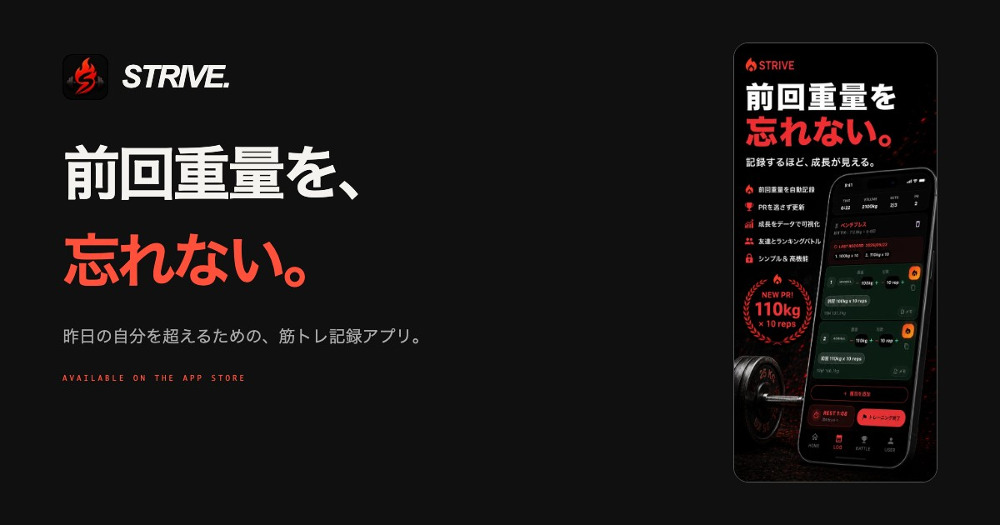

# Strive — Product Website

筋トレ記録アプリStriveの公式ランディングページ。実際の画面と開発背景を伝え、App Storeへつなぐ静的Webサイトです。

[公式サイト](https://strive-lp-xi.vercel.app/) · [App Store](https://apps.apple.com/jp/app/strive/id6770878590) · [開発者](https://github.com/jcm2bd9rn5-cyber)



## 実装

- HTML / CSS / JavaScript。ビルド工程・npm依存なし。
- 実画面を使ったスマートフォン表示と、狭い画面向けの横スクロール。
- キーボード操作、動きを抑える設定、画像の代替テキストへの配慮。
- メタ情報・OGP・サイトマップ、App Storeと問い合わせへの導線。

## ローカルで見る

```sh
git clone https://github.com/jcm2bd9rn5-cyber/strive-lp.git
cd strive-lp
python3 -m http.server 4173
```
[http://localhost:4173/](http://localhost:4173/) を開きます。

## 構成

| ファイル | 役割 |
| --- | --- |
| [index.html](index.html) | ページ本文・メタ情報・各リンク |
| [css/style.css](css/style.css) | 全体のレイアウトとレスポンシブ表示 |
| [css/hero.css](css/hero.css) | ヒーロー・端末フレーム・ストアプレビュー |
| [js/main.js](js/main.js) | スクロール時の表示演出 |
| [assets/](assets/) | アイコン・実画面・公開ストア画像 |
| [vercel.json](vercel.json) | Vercel設定 |

[起動・確認手順](QUICKSTART.md) · [編集ガイド](CONTRIBUTING.md) · [保守メモ](ROADMAP.md) · [画像・掲載情報の記録](docs/content-notes.md)
